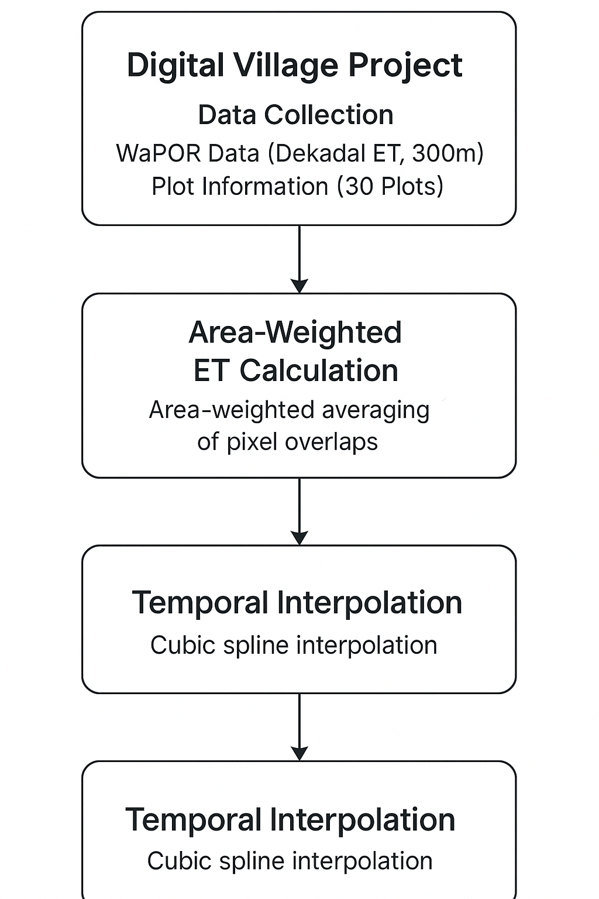

As a Remote Sensing Intern contributing to an international research initiative led by Tel Aviv University, Israel, 
I’m working on the Digital Village project—an effort aimed at transforming irrigation practices across Punjab. 
This project is not just a standalone analysis, but part of a larger movement focused on promoting sustainable water use in Indian agriculture. 
Our core objective is to evaluate evapotranspiration (ET) patterns to understand how much water is actually consumed by crops, 
and compare that with the water being applied by farmers.

I've gathered and analyzed ET data from a sample of farms selected out of 1,000 marked plots, representing a variety of irrigation methods—Direct Seeded Rice (DSR), 
Transplanted Rice (TPR), and Alternate Wetting and Drying (AWD). The data, sourced from the WaPOR satellite platform, spans from May 2024 to June 2025, 
and is being used to assess water efficiency across farm types. The findings from this project are expected to guide policy, influence agricultural practices, 
and contribute to scalable solutions for reducing excess water usage in farming. I am currently focused on the data analytics component—studying the relationship between ET 
and on-ground water levels to generate actionable insights for the farming community and stakeholders.

# 🌾 Digital Village Project: Remote Sensing – Plot-Level Evapotranspiration (ET) Estimation

## 📌 Objective

## 🌿 Why Measure Evapotranspiration (ET)?

Evapotranspiration (ET) is the sum of water lost from the soil through evaporation and from plants through transpiration. Measuring ET is essential for understanding how much water crops actually use. By analyzing ET patterns, farmers and policymakers can plan irrigation more precisely—applying just the right amount of water at the right time. This not only saves water but also improves crop health, reduces energy costs, and promotes sustainable agriculture. Especially in water-scarce regions, ET-based irrigation planning is key to increasing efficiency and supporting climate-resilient farming.

This task aimed to estimate **daily evapotranspiration (ET)** for **30 agricultural plots** across Punjab using satellite data from **FAO WaPOR** and ground-level water usage data. 

We tackled two main challenges:
- **Spatial Mismatch:** Plot sizes were smaller than satellite pixel resolution (300m).
- **Temporal Resolution:** Satellite data was provided at **dekadal intervals (10 days)**, whereas analysis required **daily estimates**.

---

## 🛰️ Data Sources

### WaPOR Satellite Data
- Source: FAO WaPOR Level-1
- Resolution: 300m
- Temporal: Dekadal ET (mm/day)

### Ground Plot Data
- 30 plots categorized into:
  - **TPR** (Transplanted Rice)
  - **DSR** (Direct Seeded Rice)
  - **AWD** (Alternate Wetting and Drying)
- Size: ~2–5 acres (smaller than a WaPOR pixel)

🔗 [Sample Plot Info](https://docs.google.com/spreadsheets/d/1UrMY4plAIWYo_-UX7tvCAZfd4BBbuUAYrSaKru6elbY/edit?usp=sharing)

---

## 🧠 Methodology

  

### 1. 📏 Area-Weighted ET Calculation (Spatial Resolution Handling)
Problem: Multiple plots fall within one pixel due to coarse resolution.

✅ **Solution:** Use **area-weighted averaging** based on the proportion of each pixel overlapping a plot. 

- **Tools Used:** Rasterio, GeoPandas, Shoelace Algorithm (to find area of plots)
- **Approach:** 
  - Overlay vector plot boundaries on ET raster data.
  - Calculate intersection areas.
  - Weight ET values based on fractional overlap.

### 2. 📈 Cubic Spline Interpolation (Temporal Smoothing)
Problem: ET data available only every 10 days → too coarse for daily insights.

✅ **Solution:** Apply **Cubic Spline Interpolation** to derive realistic daily ET curves per plot.

- Benefits:
  - Smooth daily transitions
  - More realistic than uniform division
- Libraries: SciPy, Pandas, Matplotlib

---

## 📊 Visualizations & Analysis

We created the following visualizations:
- **Daily ET Curves** for each plot
- **Boxplots** comparing TPR, DSR, and AWD
- **Whisker plots** to capture seasonal spread
- **Bar Charts** for peak vs. low ET periods

📁 Tools Used: `matplotlib`, `seaborn`, `scipy`, `QGIS`

---

## 📁 Final Output

- Daily ET values from **June 2024 to June 2025**
- Format: CSV and Excel with interpolated data
- Visualizations and summary statistics

🔗 [Final Processed Data](https://docs.google.com/spreadsheets/d/1BIZ1y6_kQP5UEn6RG4NCZykfGErjCuwx8VpyyTQAMPo/edit?usp=sharing)

---

## 🔍 Key Learnings

- Area-weighted pixel averaging is crucial when working with low-resolution satellite imagery for plot-level insights.
- Cubic spline interpolation preserves trends and avoids oversimplification in temporal data smoothing.
- Plot-level ET can be robustly estimated from satellite data, improving precision agriculture and water usage planning.

---

## 💻 Technologies & Libraries

- **Python**: Data processing and visualization
- **Libraries**: `rasterio`, `geopandas`, `matplotlib`, `scipy`, `shapely`, `pandas`
- **GIS Tools**: QGIS for shapefile and raster analysis

---

## 👨‍🔬 Author

**Asmi Gaurav**  
Remote Sensing Intern | Digital Village Project  
Thapar Institute of Engineering & Technology

---

## 📌 Citation and References

- FAO WaPOR Methodology: [wapor.apps.fao.org](https://wapor.apps.fao.org/home/WAPOR_Methodology)
- NASA LDAS Downscaling: [ldas.gsfc.nasa.gov](https://ldas.gsfc.nasa.gov/)
- QGIS Zonal Stats: [docs.qgis.org](https://docs.qgis.org/)
- Zhang et al., Journal of Hydrology (2017) – Temporal ET Spline Interpolation

---

